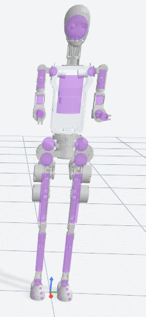

# X1（无皮肤版本）

这个目录同时包含 X1 的 `URDF` 和 `MJCF` 两套模型。`URDF` 用来查结构、质量和惯量，`MJCF` 是当前用于 MuJoCo 调试和基础仿真的版本。

## 文件说明

- `X1.urdf`：原始结构与惯量参考。
- `X1.xml`：当前 MuJoCo 主模型，已按仿真需求做裁剪，不是对 `X1.urdf` 的原样转换。
- `scene.xml`：场景入口，补充地面、光照和材质，推荐直接打开。
- `meshes/`：`URDF` 和 `MJCF` 共用的 STL 网格资源。

## URDF

- 适合查看原始连杆、关节轴、质量和惯量参数。
- 原始模型包含下肢、腰部和上肢关节，`MJCF` 调整以它为基础。
- 头部的 `<mujoco><compiler ... balanceinertia="true" .../></mujoco>` 表明导出时启用了惯量平衡修正。

## MJCF

- 根节点带 `freejoint`，初始高度为 `pos="0 0 0.97"`。
- 当前只保留下肢 12 个关节，腰部和上肢固定。
- 下肢关节统一使用 `damping="0.1"`、`armature="0.01"`、`frictionloss="0.2"`。
- 执行器类型为 `motor`，`ctrlrange` 与 `forcerange` 按关节力矩范围设置。

| 关节 | 力矩范围 |
| --- | --- |
| `left/right_hip_yaw_joint` | `[-126, 126]` |
| `left/right_hip_roll_joint` | `[-63, 63]` |
| `left/right_hip_pitch_joint` | `[-252, 252]` |
| `left/right_knee_joint` | `[-332.64, 332.64]` |
| `left/right_ankle_pitch_joint` | `[-228.06, 228.06]` |
| `left/right_ankle_roll_joint` | `[-25.2, 25.2]` |

## 使用建议

- 查原始结构、惯量和关节参数时看 `X1.urdf`。
- 在 MuJoCo 中优先打开 `scene.xml`，不要直接打开 `X1.xml`。
- 如果修改了 `URDF` 中的惯量参数，需要同步检查 `X1.xml` 中对应的 `<inertial>`。

## 注意事项

- 当前 `MJCF` 的关节数量与 `URDF` 不同。
- 如果外部控制程序按关节下标访问状态，需要同步更新索引。
- 当前模型更适合结构调试和基础仿真；做稳定站立或步态控制前，仍应检查碰撞体和接触参数。
